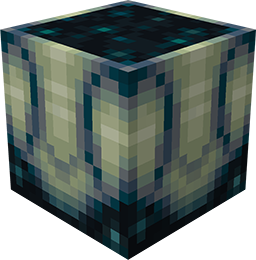
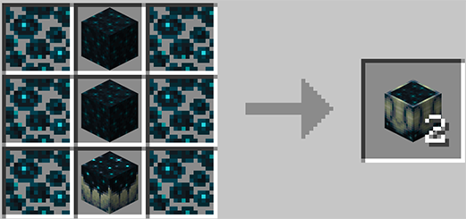
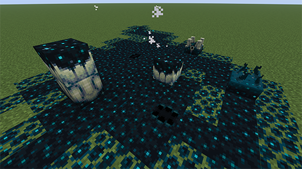
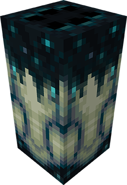

# Sculk & Jaw

**Sculk&Jaw** mod adds two sculk family blocks and a new effect called Sculkophobia.  
Deep Dark and Ancient City have become even more dangerous--be extra careful when exploring!  

## Sculk Jaw

Naturally generates in the Deep Dark biome and Ancient City structures.  
Will attack creatures that accidentally step on it. If the creature is small enough, it will be swallowed into its belly within a few seconds.  
Creatures that remain inside the Sculk Jaw for too long will continuously take Sculk Acid damage and gain increasingly higher levels of the Sculkophobia effect.  
Can only be obtained intact with the Silk Touch enchantment.  

## Concentrated Sculk

Can be crafted on a Crafting Table using the following recipe.  

Grow Sculk Catalyst on top with sculk charge.  

Can only be obtained intact with the Silk Touch enchantment.

## Combined Sculk Jaw

Try to combine a Sculk Jaw with a Concentrated Sculk in your mob farm.  
Can only be obtained intact with the Silk Touch enchantment.  

## Sculkophobia
Anyone who has experienced this kind of pain does not want to recall this feeling.  

A new effect that will reduce 2 point of max health per level.  
Sculk tentacles will surround your field of view.  

**This mod was made for our lost block: Sculk Jaw in 1.19**

**Special thanks for [sculklatch mod](https://modrinth.com/mod/sculk-latch) with [HerrChaos](https://github.com/HerrChaos), [RedVortexDev](https://github.com/RedVortexDev), [TheTrueYak](https://github.com/TheTrueYak) and [unroman](https://github.com/unroman), who provided inspiration for this mod.**

