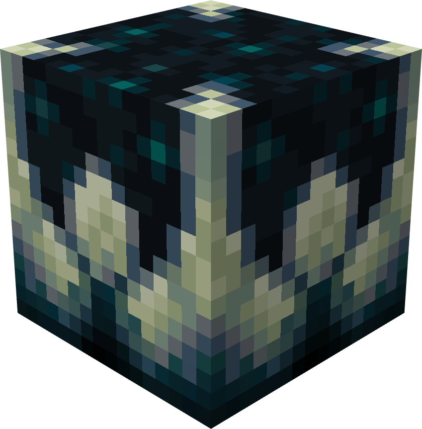

# Sculk&Jaw  

**Sculk&Jaw** mod expanded sculk blocks family and added few new effects.  
Deep Dark and Ancient City have become even more dangerous--be extra careful when exploring!  

## Sculk Jaw

Naturally generates in the Deep Dark biome and Ancient City structures.  
Will attack creatures that accidentally step on it. If the creature is small enough, it will be swallowed into its stomach within a few seconds.  
Creatures that remain inside the Sculk Jaw for too long will continuously take [Acid Etching](#acid-etching) effect damage and gain increasingly higher levels of the [Sculkophobia](#sculkophobia) effect.  
When got caught by a Sculk Jaw, try to climb up and get out of its stomach, do not forget to sneak out or else it will drag you in again.  
Will eat and storage items dropped on top of it, you can retrieve them by breaking the block (**Silk Touch** recommended).  
Can only be obtained intact with the Silk Touch enchantment.  
Can be filled with a bucket of [Sculk Acid](#sculk-acid) to make it more dangerous or just as a trash can, when filled with Sculk Acid, it will directly destroy any items into its mouth.    
Can be used to brew [Acid Etching potions](#acid-etching-potions).  

When filled with Sculk Acid, it will no longer bite creatures, but will damage them with Acid Etching effect when they step into it.

## Concentrated Sculk

Can be crafted on a Crafting Table using the following recipe.  

It will generate Sculk Catalyst on top with sculk charge, which makes Sculk Catalyst more easy to regenerate.  

Can only be obtained intact with the Silk Touch enchantment.

## Combined Sculk Jaw

Try to combine a [Sculk Jaw](#sculk-jaw) with a [Concentrated Sculk](#concentrated-sculk) in your mob farm.  
It will store experiences dropped by mobs it killed, and you can retrieve them by breaking the block (**Silk Touch** recommended) or placing a Sculk Jelly near to it.  
Can only be obtained intact with the Silk Touch enchantment.  

## Sculk Acid

A new fluid that can be collected with [Acid Etching](#acid-etching-potions) potions and Cauldrons, it also gives [Acid Etching](#acid-etching) effect to mobs step into it.  
Try to fill a Cauldron with Sculk Acid potions and pick it up with a bucket.  

## Sculk Jelly

A new block generated by mixing Sculk Acid fluid and Water fluid together.  
Place Sculk Jelly near Combined Sculk Jaw to extract experience orbs.  

## Acid Etching Potions
You can brew Acid Etching potions using [Sculk Jaw](#sculk-jaw) and Awkward potions, also have its splash and lingering variants.  

## Acid Etching
***It will be safe as long as my armor have not be broken... I will be safe, right?***  

A new effect that will reduce 2 points of armor per level, and will continuously damage your health.

## Sculkophobia
***Anyone who has experienced this kind of pain does not want to recall this feeling.***  

A new effect that will reduce 2 points of max health per level.  
Sculk tentacles will surround your field of view.  

## Sculk Acid Lake
A new feature that can be found in Deep Dark biome, filled with Sculk Acid and surrounded by cave plants.

**This mod was made for our lost block: Sculk Jaw in 1.19**

**Special thanks for [sculklatch mod](https://modrinth.com/mod/sculk-latch) with [HerrChaos](https://github.com/HerrChaos), [RedVortexDev](https://github.com/RedVortexDev), [TheTrueYak](https://github.com/TheTrueYak) and [unroman](https://github.com/unroman), who provided inspiration for this mod.**

